# 🏗 GeotekMetallComplete — WPF приложение для управления строительными проектами

---

## 🚀 О проекте

**GeotekMetallComplete** — это WPF-приложение для автоматизации работы
строительной компании, позволяющее пользователю:
- 👥 Входить в систему под одной из трёх ролей (администратор, бухгалтер, работник)
- 📝 Создавать и обрабатывать заявки на строительные работы
- 🏗 Управлять проектами, этапами и задачами с автоматическим расчётом статуса
- 💰 Вести бюджет, транзакции и финансовые отчёты по проектам
- 📄 Загружать, просматривать, редактировать и печатать документы (Word, PDF)
- 📷 Отправлять фотоотчёты по задачам (до 10 фото, защита от дублей)
- 👤 Редактировать свой профиль

---

## 🖼 Скриншоты

<b>🔐 Окно авторизации</b>

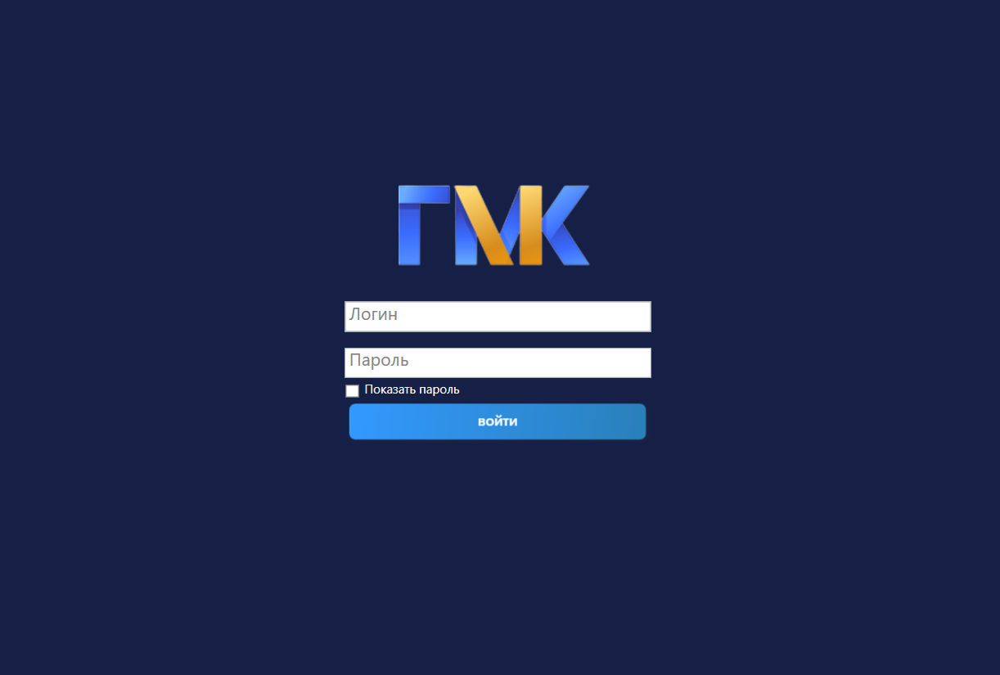

<b>👑 Окно администратора</b>

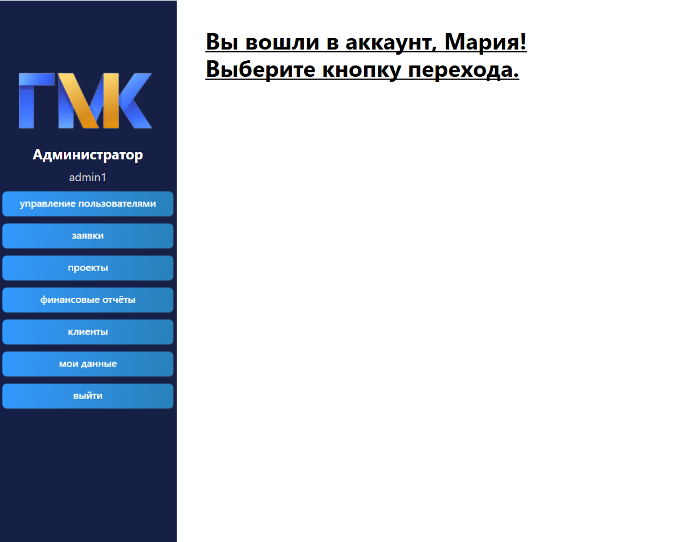

<b>💰 Окно бухгалтера</b>

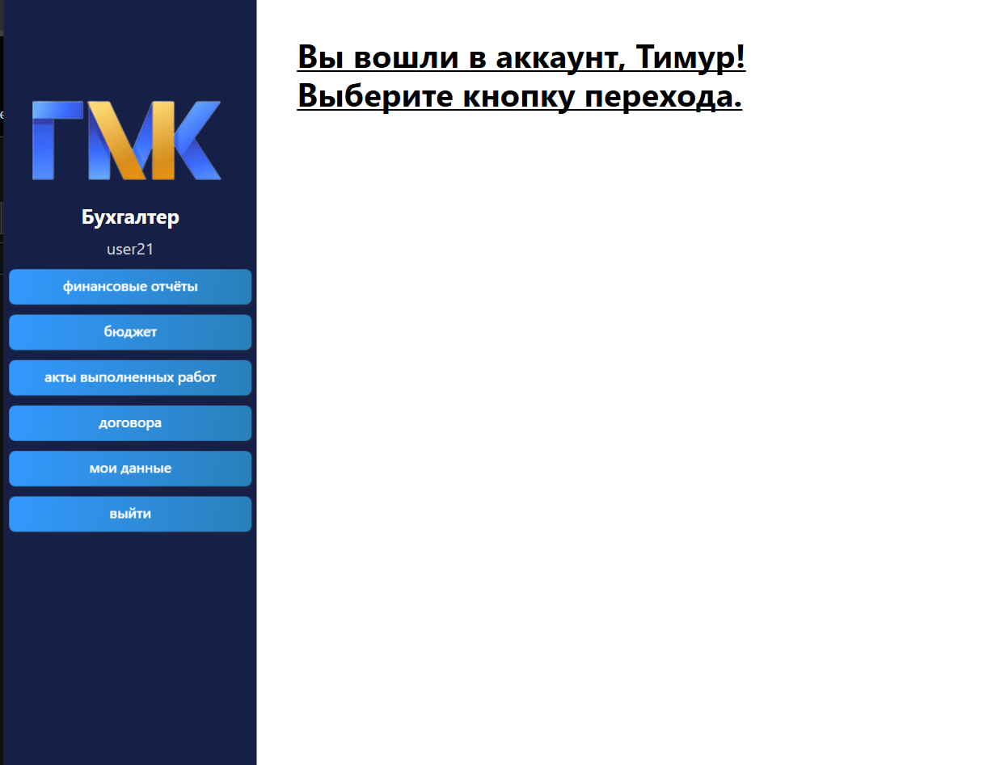

<b>👷 Окно работника</b>

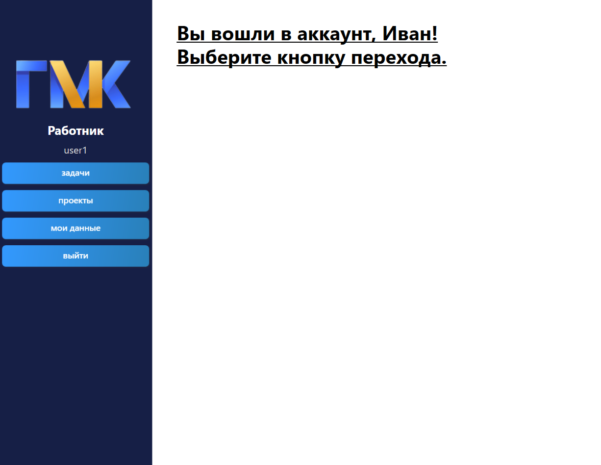

<b>📋 Управление пользователями</b>

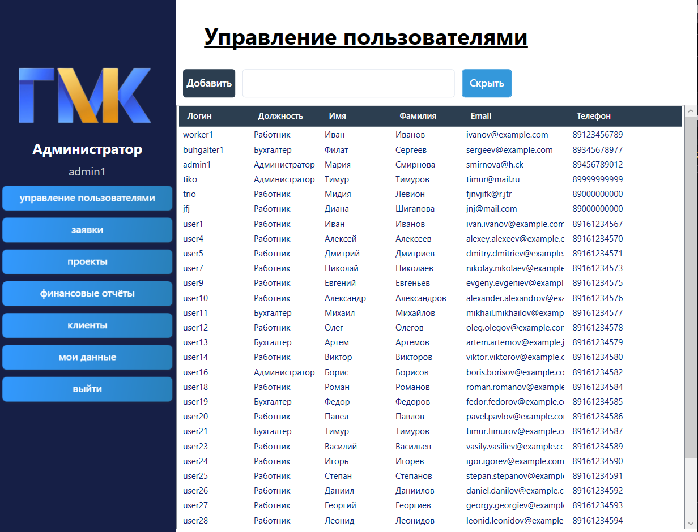

<b>📨 Управление заявками</b>

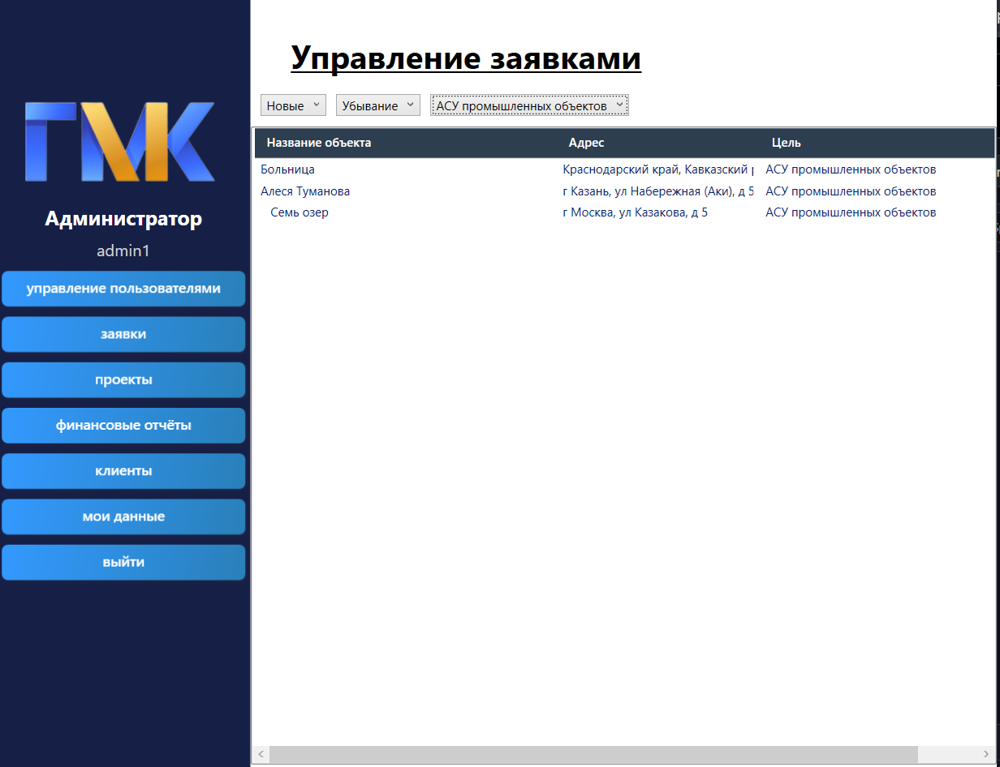

<b>🏗 Управление проектами и этапами</b>

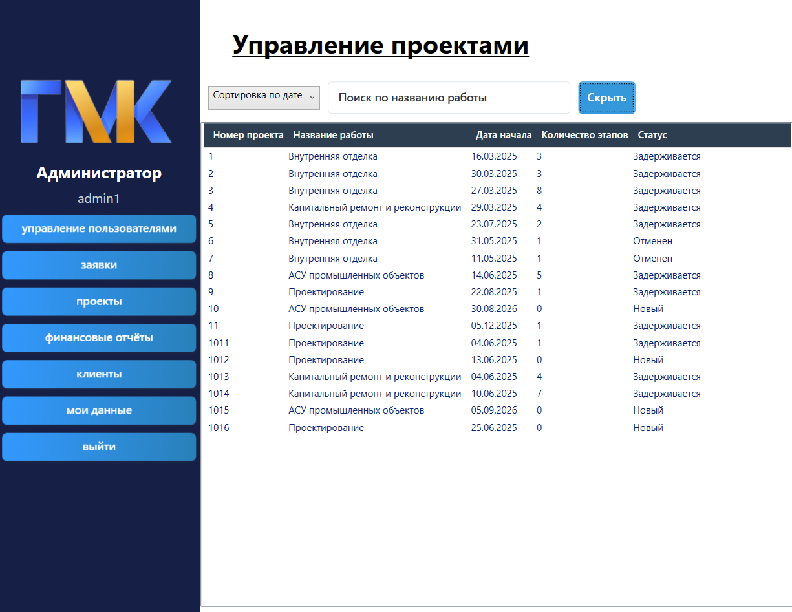

<b>💵 Бюджет и транзакции</b>

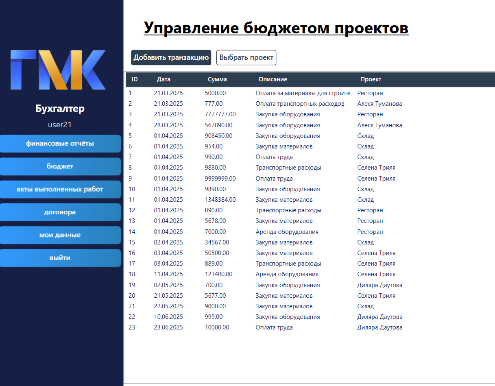

<b>📑 Aкты выполненных работ</b>

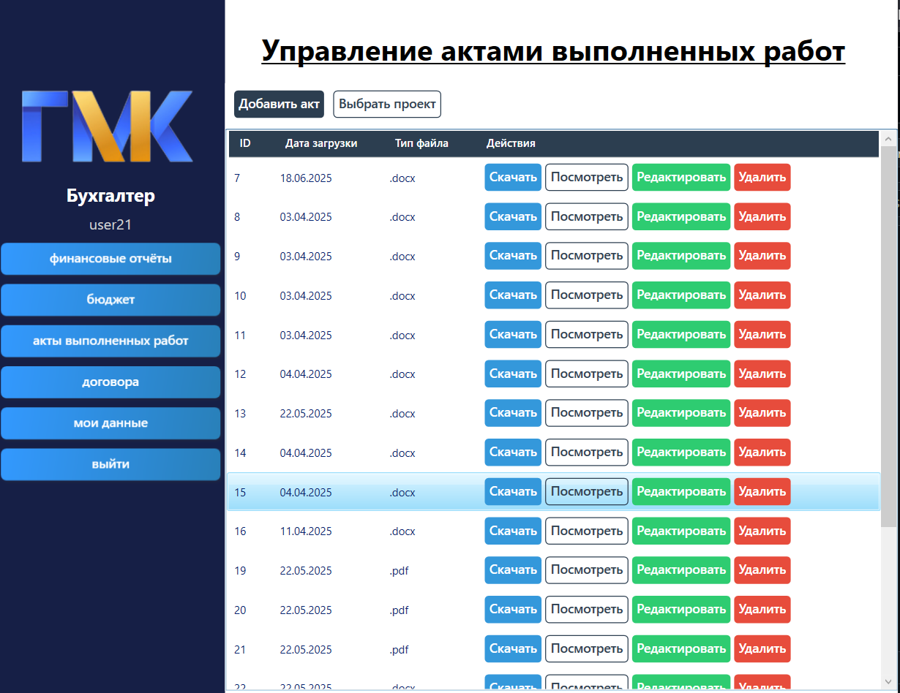

<b>📊 Финансовые отчёты</b>

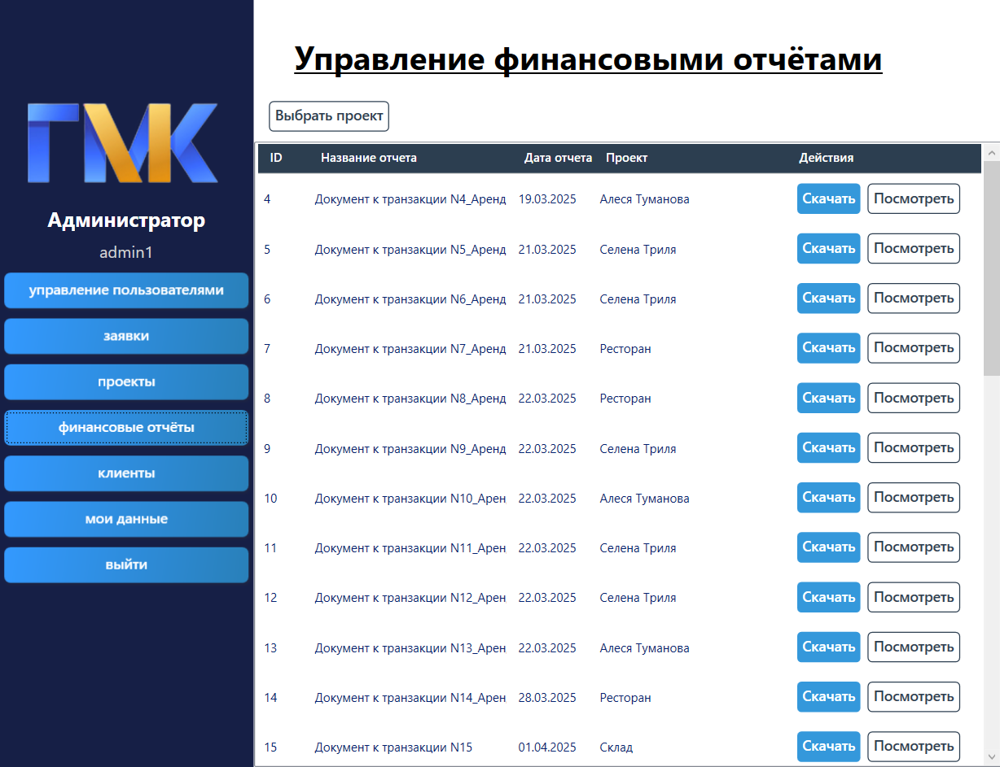

<b>✏️ Редактор документов</b>

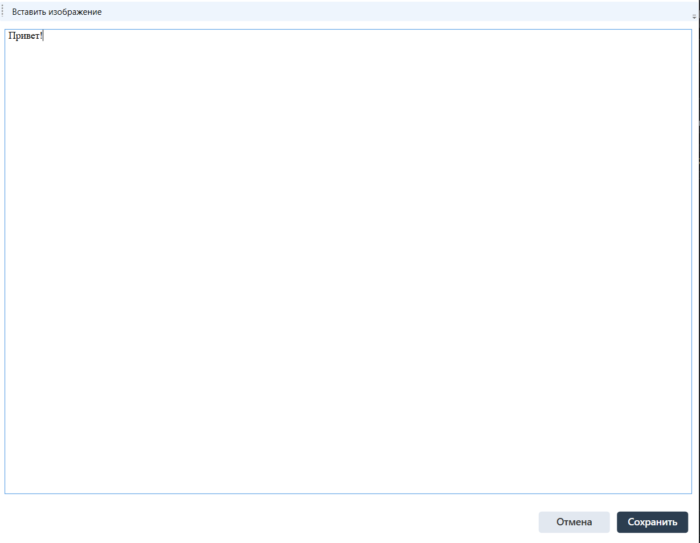

<b>👤 Мои данные</b>

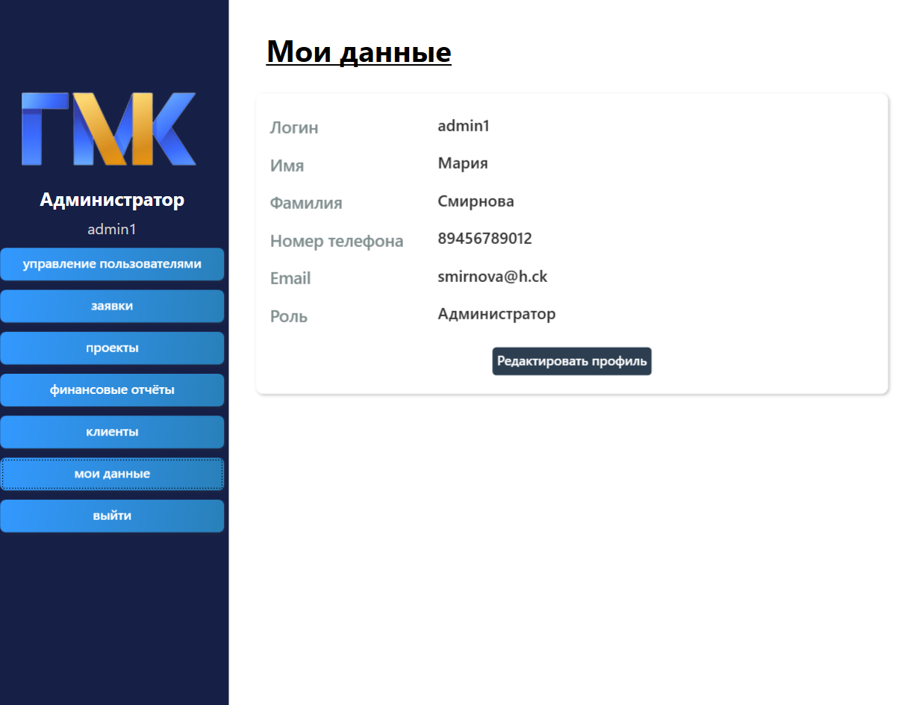

---

## 🛠 Технологии

<b>Показать полный стек</b>

| Слой | Технология |
|------|------------|
| UI | WPF (.NET Framework 4.8) |
| ORM | Entity Framework 6 |
| БД | SQL Server |
| Документы | OpenXML, DocX (Xceed), iTextSharp, PdfPig |
| Шифрование | AES + SHA-256 |
| Изображения | WPF Imaging (JpegBitmapEncoder, BitmapImage) |

---

## 🏗 Архитектура

<b>Кратко о структуре</b>

Приложение построено по классической WPF-архитектуре с разделением
на окна-оболочки, страницы и модели данных:

- **Windows** — окна ролей (AdminWindow, AccountantWindow, WorkerWindow)
- **Pages** — страницы для каждой функциональной области
- **Models** — 16 сущностей
- **Services** — утилиты (шифрование, хелперы для placeholder)

<b>Основное</b>

| Класс | Назначение |
|-------|-----------|
| Authorization | Авторизация с проверкой роли |
| AdminWindow / AccountantWindow / WorkerWindow | Окна для ролей |
| userManagementPage | CRUD пользователей и ролей |
| requestManagementPage | Обработка заявок, создание проектов |
| ProjectsManagementPage | Управление проектами, этапами, задачами |
| BudgetPage | Транзакции с прикреплением файлов |
| ContractsPage / ActsOfWorkPage | Договоры и акты выполненных работ |
| FinanceManagementPage | Финансовые отчёты по проектам |
| DocumentEditorWindow | Создание и редактирование .docx / .pdf |
| viewingDocument | Просмотр и печать документов |
| General | AES-шифрование + хелперы для TextBox |

---

## 🔐 Роли и возможности

<b>Администратор</b>

- Управление пользователями (создание, редактирование, удаление)
- Обработка заявок клиентов (одобрение / отклонение)
- Создание проектов с назначением менеджера
- Управление клиентами, проектами, финансовыми отчётами
- Просмотр деталей проектов, задач и отчётов

<b>Бухгалтер</b>

- Финансовые отчёты по проектам
- Управление бюджетом (транзакции с прикреплением документов)
- Акты выполненных работ
- Загрузка, просмотр, редактирование, печать документов

<b>Работник</b>

- Просмотр своих задач с фильтрацией по проекту и статусу
- Просмотр деталей проектов
- Отправка фотоотчётов по задачам (до 10 фото)
- Редактирование профиля

---

## ⚙️ Установка

<b>Требования</b>

- Windows 10/11
- Visual Studio 2019/2022
- .NET Framework 4.8
- SQL Server (LocalDB или полноценный сервер)
- NuGet-пакеты: EntityFramework, DocumentFormat.OpenXml, Xceed.Words.NET, iTextSharp, PdfPig

